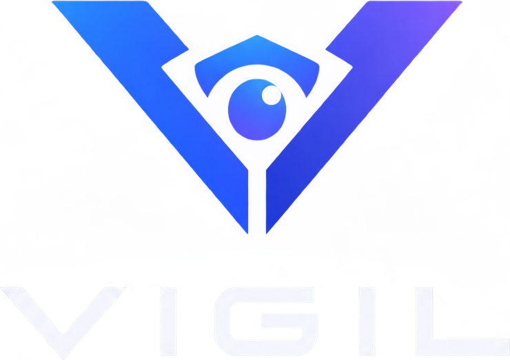

<p align="center"></p>

# Vigil

[](https://github.com/mdlog/vigil/actions/workflows/test.yml)
[](foundry.toml)
[](https://getfoundry.sh/)
[](LICENSE)

Session-aware collateral risk layer for tokenized equity on Morpho Blue, built for Robinhood Chain.

Tokenized stocks trade 24/5 and their price feeds freeze at the close; the chain and the lending market run
24/7. Every weekend a Morpho market holding NVDA or TSLA as collateral is exposed to Monday's opening gap at
Friday's price, with no intermediate price at which a liquidation could have executed. Vigil derives the
exchange session on-chain and, without modifying Morpho, ramps a haircut into the oracle price before each
closure, charges members a premium for holding leverage through it, unwinds them softly while the market is
still open, and repays any remaining shortfall from a first-loss backstop inside the liquidation itself.

**Live:** [dashboard](https://mdlog.github.io/vigil/) (Robinhood Chain testnet; read-only panels plus wallet actions) · **Docs:** [design](docs/DESIGN.md) ·
[deployments](docs/DEPLOYMENTS.md) · [evidence and verification](docs/VERIFICATION.md) · [mainnet runbook](docs/MAINNET.md) ·
[audit scope](docs/AUDIT_SCOPE.md)

## How it works

Vigil attaches to an unmodified Morpho Blue market at three points:

| Attachment | Mechanism |
|---|---|
| Oracle (`IOracle`) | Collateral value falls as a function of the length of the closure being entered — derived from an on-chain NYSE calendar, ramped over time, capped at 500 bps, never stepped. |
| Premium | Opt-in borrowers ("members") pay a session premium in USDG, accrued from an on-chain index over the closures they hold leverage through. |
| Backstop | An ERC-4626 first-loss tranche in USDG collects the premiums and covers shortfalls that arise while the market is closed. |

Members additionally get a **soft unwind** — a session-aware, time-based partial pre-liquidation that runs before
the weekend — and **covered liquidation**: `liquidateWithCover` repays the shortfall from the backstop in the
same transaction as the seizure, so Morpho never records bad debt and suppliers stay whole.

```
VigilCalendar → VigilSessionOracle → VigilRiskEngine → VigilOracle ─── Morpho Blue market (stock / USDG)
VigilPremium ──── VigilBackstop ──── VigilLossReporter · VigilPreLiquidation
```

| Contract | Responsibility |
|---|---|
| `VigilCalendar` | NYSE session from `block.timestamp`: ET with DST, holidays and early closes 2024–2028 (add-only) |
| `VigilSessionOracle` | Effective regime = max(calendar, feed staleness, keeper attestation, token corporate action); premium index |
| `VigilRiskEngine` | Haircut surface `H(L)` ramped from time, scheduled events, premium tables; rate-limited calibration |
| `VigilOracle` | Morpho `IOracle`: feed × (1 − min(H, cap)); fails closed on an unexpected stale feed |
| `VigilPremium` | USDG escrow per borrower; membership and delinquency |
| `VigilBackstop` | ERC-4626 vault; exit by request → 7-day cooldown → claim during `MARKET`; per-market coverage cap |
| `VigilPreLiquidation` | Soft unwind of members to a target LTV at a regime-dependent discount (Morpho PreLiquidation pattern) |
| `VigilLossReporter` | `liquidateWithCover`: cover from the backstop, repay on behalf, then Morpho's liquidation |

Eight immutable contracts (1.9 k lines of Solidity), no proxies, no pause. Design rationale, parameters and calibration:
[docs/DESIGN.md](docs/DESIGN.md). One periphery contract, `VigilMigrator`, moves a supply position from any other
USDG market on the same Morpho into the Vigil market in one transaction (the Morpho authorisation is granted inside
the call from an EIP-712 signature).

## Evidence

| Setting | Result |
|---|---|
| Historical replay, NVDA/USDG at 86 % LLTV ([`script/Demo.s.sol`](script/Demo.s.sol)) | 5 Aug 2024 (−14.2 %) and 27 Jan 2025 (−12.5 %): control market socialised 40.59 and 30.95 USDG of bad debt per position, the Vigil market 0; a −12 % gap on a max-LTV member: 70.12 USDG shortfall paid by the backstop, suppliers untouched |
| Live testnet, Robinhood's TSLA token and Paxos USDG ([run](docs/DEPLOYMENTS.md#end-to-end-run-on-the-live-testnet)) | 37 transactions through supply, borrow, membership, backstop, keeper attestation, soft unwind, a replayed −10.81 % gap and a covered liquidation ([cover tx](https://explorer.testnet.chain.robinhood.com/tx/0x98e9fbf1e2382f6b7f0cca84105d465f5c41eff401f767eb70b1decf3502939a)) |
| Migration from a plain-oracle 62.5 % market ([demo](docs/DEPLOYMENTS.md#migration-demo--leaving-a-plain-oracle-market-in-one-transaction-20-sep-2026)) | a supplier's 20 USDG moved into the Vigil market from the dashboard with one signature and one transaction ([migrate tx](https://explorer.testnet.chain.robinhood.com/tx/0xf2a4148181c355fb5668d198b30aacd54dd593e9ebf1c36ccefaf68746a5380c)) |
| Mainnet fork, real Morpho, AdaptiveCurveIRM, USDG, NVDA token and Chainlink feeds ([`test/fork`](test/fork/MainnetFork.t.sol)) | frozen Friday feed usable with the weekend haircut; real ERC-8056 flags; full weekend cycle with a 31.20 USDG shortfall covered on the real Morpho |
| Calibration, four years of NVDA/AAPL/TSLA gaps ([`calibrator/`](calibrator/README.md)) | no closure in the sample produced bad debt on a Vigil market; the plain market took three |

Details and the on-chain facts behind every parameter: [docs/VERIFICATION.md](docs/VERIFICATION.md).

## Getting started

Requires [Foundry](https://getfoundry.sh/) (forge 1.5+) and Node 22 for the dashboard and keeper.

```bash
git clone --recurse-submodules https://github.com/mdlog/vigil.git && cd vigil
forge build
forge test                                                        # 80 tests: unit, scenarios, invariants, fuzz regressions
FOUNDRY_PROFILE=fork FOUNDRY_FORK_TESTS=1 forge test --match-path test/fork/MainnetFork.t.sol   # 3 tests on a mainnet fork
forge script script/Demo.s.sol -vv                                # the historical replay
```

Dependencies are pinned in `foundry.lock`: Morpho Blue v1.0.0, OpenZeppelin 4.9.6, forge-std 1.16.2. solc 0.8.19,
`evm_version = "paris"`; the `fork` profile runs the EVM at Cancun for chains whose contracts use `PUSH0`.

```bash
cd web && npm ci && npm run dev        # dashboard at http://127.0.0.1:5173/vigil/ (VIGIL_MANIFEST picks the deployment)
cd ops && npm ci && npm run keeper -- status                 # keeper: status | poke | unwind | liquidate | attest
```

The dashboard's **Use it** panel is the end-user interface: connect an injected wallet and lend, borrow, join as a
member (authorise the soft unwind, fund the premium escrow) or back the vault (deposit, request and claim a
withdrawal) against the same contracts the page reads. Every action is simulated before it is sent. `npm run smoke`
drives the whole flow in a headless browser against an Anvil fork (see [docs/DEPLOYMENTS.md](docs/DEPLOYMENTS.md#dashboard)).

## Deployment

| Network | Chain ID | Status |
|---|---|---|
| Robinhood Chain testnet | 46630 | live, v4 — [manifest](deployments/robinhood-testnet-46630.json) |
| Robinhood Chain mainnet | 4663 | prepared, not deployed — [runbook](docs/MAINNET.md) |

Testnet v4 (19 Sep 2026): a TSLA/USDG market on Robinhood's own TSLA stock token and Paxos's USDG. The testnet
has no Chainlink feeds or Morpho, so the feed and the IRM are mocks and Morpho Blue is deployed from source. All
contracts are source-verified on the [explorer](https://explorer.testnet.chain.robinhood.com).

| Contract | Address |
|---|---|
| `VigilCalendar` | [`0x650e89feDA871e194a359D8f2b9eDa5FA50De503`](https://explorer.testnet.chain.robinhood.com/address/0x650e89feda871e194a359d8f2b9eda5fa50de503) |
| `VigilSessionOracle` | [`0xa1cF321C8b4B49C83CB679d821C8315213B0f0B2`](https://explorer.testnet.chain.robinhood.com/address/0xa1cf321c8b4b49c83cb679d821c8315213b0f0b2) |
| `VigilRiskEngine` | [`0xAEc38A26eACfE9F6c908CDd771866C5b56d87c7A`](https://explorer.testnet.chain.robinhood.com/address/0xaec38a26eacfe9f6c908cdd771866c5b56d87c7a) |
| `VigilOracle` | [`0x79DA01DB22808E3A7397B788F171a7647b1bEf8f`](https://explorer.testnet.chain.robinhood.com/address/0x79da01db22808e3a7397b788f171a7647b1bef8f) |
| `VigilPremium` | [`0x416f3716C226c99e5A0296FDDa9BA01496348EC9`](https://explorer.testnet.chain.robinhood.com/address/0x416f3716c226c99e5a0296fdda9ba01496348ec9) |
| `VigilBackstop` | [`0x031D0cAb44C9A42e2dACf51e0F3b3dcCE72356c9`](https://explorer.testnet.chain.robinhood.com/address/0x031d0cab44c9a42e2dacf51e0f3b3dcce72356c9) |
| `VigilPreLiquidation` | [`0xa58609838474a30Ea1eBE77d59B6f786ABC55978`](https://explorer.testnet.chain.robinhood.com/address/0xa58609838474a30ea1ebe77d59b6f786abc55978) |
| `VigilLossReporter` | [`0xC6E4428fD7cBAFBe9F1d2Bbca61C44eA984AFf16`](https://explorer.testnet.chain.robinhood.com/address/0xc6e4428fd7cbafbe9f1d2bbca61c44ea984aff16) |
| `VigilMigrator` | [`0x4149C1B22DD10BA6CDc04e248aEC288642b67aD0`](https://explorer.testnet.chain.robinhood.com/address/0x4149c1b22dd10ba6cdc04e248aec288642b67ad0) |
| TSLA (Robinhood, collateral) | [`0xC9f9c86933092BbbfFF3CCb4b105A4A94bf3Bd4E`](https://explorer.testnet.chain.robinhood.com/address/0xC9f9c86933092BbbfFF3CCb4b105A4A94bf3Bd4E) |
| USDG (Paxos, loan token) | [`0x7E955252E15c84f5768B83c41a71F9eba181802F`](https://explorer.testnet.chain.robinhood.com/address/0x7E955252E15c84f5768B83c41a71F9eba181802F) |
| Morpho Blue, MockFeed, MockIRM | [`0x9960…038b`](https://explorer.testnet.chain.robinhood.com/address/0x99607363652591fff66ba23ef8d91563ca48038b) · [`0x87AE…49C3`](https://explorer.testnet.chain.robinhood.com/address/0x87ae97dd57686e9fbc85ce9d33cc39b6594c49c3) · [`0xc15D…4630`](https://explorer.testnet.chain.robinhood.com/address/0xc15db6c9c5b7bad92c088e0918d5c720a5c44630) |

Market id `0x165f9db8f5e1d9982a35dfaadb3f944cf747970c8f819f16f10105f5c7eb6e04` (LLTV 86 %).

```bash
cp .env.example .env                                              # PRIVATE_KEY and optional dependency addresses
forge script script/Deploy.s.sol --rpc-url robinhood_testnet                 # simulate
forge script script/Deploy.s.sol --rpc-url robinhood_testnet --broadcast     # deploy
node script/manifest.mjs --chain 46630 --env .env --out deployments/…        # manifest from the broadcast record
node script/verify.mjs --chain 46630                                         # source verification on Blockscout
```

Every dependency (`MORPHO`, `IRM`, `USDG`, `STOCK_TOKEN`, `FEED`, `USDG_FEED`) is read from the environment and
falls back to a mock when unset; mainnet values are in `.env.mainnet.example`. History, the feed heartbeat and
the full deployment guide: [docs/DEPLOYMENTS.md](docs/DEPLOYMENTS.md).

## Security

The contracts are immutable and have no pause or upgrade path. Three roles exist, and none of them can change a
price, remove a holiday, block a liquidation or touch user funds:

| Role | Can |
|---|---|
| `guardian` | add holidays ≥ 7 days ahead, register assets and markets, set the coverage cap and poke bounty, transfer itself |
| `calibrator` | move the risk surface within on-chain bounds and rate limits, schedule events, set premium tables |
| `keeperSigner` | sign attestations that only *tighten* the session (halts, delayed opens), 30-minute life |

Without any off-chain actor the calendar and feed freshness alone produce the full daily cycle. The deployer
holds every role until [`script/Handover.s.sol`](script/Handover.s.sol) moves them to contract holders.
**No external audit has been performed**; [docs/AUDIT_SCOPE.md](docs/AUDIT_SCOPE.md) describes the scope and the
assumptions a reviewer should try to break. Report vulnerabilities privately to the maintainer below.

## Repository

```
src/            the eight contracts, periphery/VigilMigrator, interfaces (IVigil, IAggregatorV3, IStockToken) and mocks
script/         Deploy, MainnetPreflight, Handover, Demo, E2E; manifest.mjs and verify.mjs
test/           unit, scenarios (historical replays), invariants, fork (mainnet)
ops/            keeper: status, poke, unwind, liquidate, attest
web/            read-only dashboard (Vite, viem), deployed to GitHub Pages
calibrator/     data, calibration and backtest behind the parameters
video/          records and narrates an end-to-end run from the dashboard
deployments/    manifests per network and version
docs/           design, deployments, verification, mainnet runbook, audit scope
```

## Status

- Live on Robinhood Chain testnet with real Robinhood and Paxos tokens; dashboard on GitHub Pages; keeper and CI status watch running.
- Mainnet: pre-flight passes (except the deployer's balance), deployment simulated, runbook and handover ready. Gated on an audit, a multisig and funding — see [docs/MAINNET.md](docs/MAINNET.md).
- Out of scope for now: cross-asset portfolio margin, senior/junior tranches, governance, non-ERC-8056 assets, coverage for borrowers who do not pay the premium.

## Contributing

Run `forge fmt`, `forge build --sizes`, `forge test` and `forge lint` before opening a pull request; CI enforces the
first three plus the calibrator and keeper tests.

## License

MIT — see [LICENSE](LICENSE). Maintainer: mdlog ([adiadi2411@gmail.com](mailto:adiadi2411@gmail.com)).
