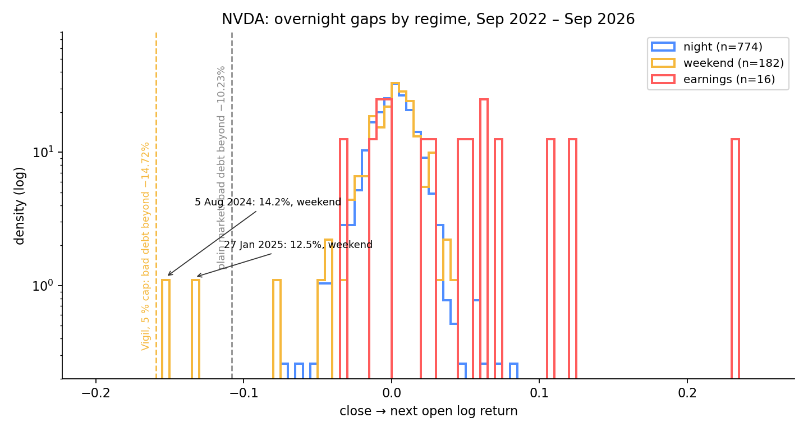
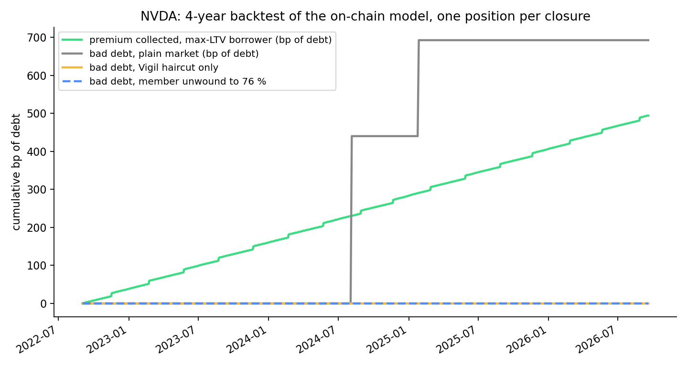

# Design

The reasoning behind Vigil: the problem, the mechanism, the contracts, the parameters and the calibration that
produced them. The [README](../README.md) is the summary; this is the long form.

## The problem

> Robinhood Chain (Arbitrum Nitro) runs 24/7. Chainlink equity price feeds run 24/5 and **freeze for the whole
> weekend**. In four years of NVDA data, both gaps that would have produced bad debt in an 86 % LLTV market
> happened at **Monday open** (5 Aug 2024 −14.2 %, 27 Jan 2025 −12.5 %). Utilization-based interest curves
> charged nothing for either. Vigil turns that risk into a number — a haircut ramped in before the close, a
> premium paid into a first-loss tranche, a soft unwind while liquidity still exists — without touching
> Morpho's core.

Tokenized equities on Robinhood Chain (ERC-8056 stock tokens such as NVDA, AAPL, TSLA) can be used as
collateral in Morpho Blue markets. Every week there is no regular session for 65.5 hours (Friday 16:00 →
Monday 09:30 ET), and for 48–52 of them the on-chain price feed does not move at all: Robinhood's Chainlink
feeds stop on Friday evening and resume when the overnight session opens at Sunday 20:00 ET (NVDA 52.1 h,
TSLA 52.2 h, SPCX 48.9 h on 18–21 Sep 2026). The weekend's move therefore hits a position at the *Friday*
price, with no price in between at which a partial liquidation could have saved it, and first shows up in
thin overnight prints. Lenders are effectively writing a free option, and a utilization-based interest rate
model has no way to see it. Vigil prices the whole regular-session closure (L = 65.5 h) and keeps the haircut
until the regular open: overnight prints are thin, and Chainlink's 24/5 guide warns that jumps of 10–20 % or
more at session boundaries are possible in low liquidity.

## How it works

Vigil is not a lending protocol. It attaches to an **unmodified** Morpho Blue market through three points:

| Attachment point | What Vigil does |
|---|---|
| **Oracle** (`IOracle`) | Effective collateral value falls as a function of the *duration of the closure* being entered — derived from an on-chain exchange calendar and ramped over time, never stepped. |
| **Premium** | Borrowers who opt in pay a *session premium* in USDG on top of the market's interest, accrued from an on-chain index. |
| **Backstop** | An ERC-4626 first-loss tranche in USDG receives the premiums and absorbs shortfalls that arise while the market is closed. |

Members (borrowers who pay the premium) additionally get a **soft unwind** — a session-aware, time-based
Dutch partial pre-liquidation that runs *before* the weekend, while the collateral can still be sold — and
**loss coverage**: `liquidateWithCover` lets the backstop repay a member's shortfall in the same transaction as
the seizure, so Morpho never realizes bad debt and suppliers are kept whole.

## Architecture

```
 VigilCalendar ──► VigilSessionOracle ──► VigilRiskEngine ──► VigilOracle (Morpho IOracle) ──► Morpho market (NVDA/USDG)
 (ET clock, DST,    regime, feedIsUsable,   ramped H(L),          price × (1 − min(H, 500 bps))
  on-chain holidays) keeper attest ≤ CLOSED, scheduled events,
                     premium index          π_ref, m(b)

 VigilPremium ──premium──► VigilBackstop (ERC-4626, first-loss) ──cover──► VigilLossReporter.liquidateWithCover
 VigilPreLiquidation: soft unwind for members at H_soft = max(H, cap + 200 bps), time-based Dutch auction
```

| Contract | Responsibility |
|---|---|
| `VigilCalendar` | Deterministic US exchange session calendar from `block.timestamp` (DST 2022–2030 hard-coded, NYSE holidays and early closes 2024–2028 verified against nyse.com; holidays can only be *added*, never removed). |
| `VigilSessionOracle` | Effective regime per asset (calendar + feed freshness + token `oraclePaused`/`effectiveAt` + keeper attestations that may only tighten, ≤ `CLOSED`), `feedIsUsable`, piecewise premium index. |
| `VigilRiskEngine` | Risk surface per asset: `H(L) = clamp(H_floor + k·σ·eventMult·√(L/τ_night))`, ramped purely from time, scheduled events (earnings), `π_ref(L)` and `m(b)` tables. |
| `VigilOracle` | Morpho `IOracle`. Reverts only on `CORP_ACTION` or an *unexpected* stale feed; a feed frozen over the weekend is the normal state. |
| `VigilPremium` | USDG escrow, `due = borrowed × m(b) × Δindex`, membership and delinquency. |
| `VigilBackstop` | ERC-4626 vault over USDG. Exit is request → 7-day cooldown → claim during `MARKET` at the claim-time price. `coverBadDebt` callable only by the loss reporter. |
| `VigilPreLiquidation` | Morpho PreLiquidation pattern (opt-in via `setAuthorization`), session-aware threshold, partial unwind to a target LTV. |
| `VigilLossReporter` | `liquidateWithCover`: the backstop repays a member's shortfall *before* seizure in one transaction — Morpho never realizes bad debt. |

Every contract is immutable: no proxies, no pause switch, the largest 13.1 KB of runtime bytecode (limit 24 KB).

## Default parameters

Calibrated from four years of NVDA close-to-open returns (Sep 2022 – Sep 2026); see `script/DeployLib.sol` and [Calibration](#calibration).

| Parameter | Value | Note |
|---|---|---|
| σ (overnight gap, EWMA) | 1.6 % | earnings nights ≈ 4× wider, handled as scheduled events |
| k (tail multiplier) | 3.0 | empirical 99 % quantile, not the Gaussian 2.33 |
| H_floor / H_max (risk engine) | 50 bps / 2,500 bps | |
| Market haircut cap (oracle) | 500 bps | bounds cascade risk; soft threshold sits 200 bps above |
| Soft-unwind target LTV | 76 % | with 86 % LLTV |
| Backstop cooldown | 7 days | guarantees every exit crosses a weekend |
| Max index segments per `poke` | 128 | ≈ 4 weeks of calendar segments without a keeper |

## Calibration

`calibrator/` holds the data and the two-stage calibration behind every number above: four years of daily close-to-open gaps for NVDA, AAPL and TSLA (Sep 2022 – Sep 2026), split by regime, with Student-t and peaks-over-threshold tails, and a backtest that replays the **on-chain** model (its integer arithmetic is replicated and checked against `test/unit/CurveFixture.t.sol`) over every closure.



The one fact that explains the product: in four years of NVDA, both gaps that would have produced bad debt at 86 % LLTV were Monday opens (5 Aug 2024 −14.2 %, 27 Jan 2025 −12.5 %). With the deployed surface and the 500 bps market cap the buffer of a max-LTV position during a closure grows from 10.23 % to 14.72 %, and **no closure of NVDA, AAPL or TSLA in the sample produced bad debt on a Vigil market** — the plain market took three. The residual tail beyond 14.72 % is what the premium and the backstop are for; `calibrator/report_full.md` gives its probability per weekend from the GPD fit and compares the collected premium with the expected loss under three estimators (the honest answer is a wide band, which is why the tables stay adjustable by the calibrator role).



Reproduce: `pip install -r calibrator/requirements.txt && python calibrator/full_calibration.py --offline` (see `calibrator/README.md`).

## Roles and trust assumptions

| Role | Can | Cannot |
|---|---|---|
| `guardian` | add holidays / half days ≥ 7 days ahead, register assets and markets, wire contracts, set coverage cap and poke bounty, transfer its own role | remove a holiday, change haircuts or prices, pause anything, block a liquidation |
| `calibrator` | update the risk surface, premium tables and scheduled events | move parameters outside the on-chain bounds and rate limits |
| `keeperSigner` | sign EIP-712 attestations that *tighten* the regime (halts, emergency closes, unlisted holidays), regime ≤ `CLOSED` | loosen a regime, force `CORP_ACTION`, make the oracle revert |
| `lossReporter` (contract) | draw on the backstop through `coverBadDebt` during a covered liquidation | anything else |

`CORP_ACTION` can only originate from the stock token itself (`oraclePaused()` / `effectiveAt()`). Without any
keeper, the calendar and feed freshness alone produce the full daily cycle; off-chain services (calibrator,
keeper, unwind bot) can only tighten and are not required for safety. The deployer holds every role until
`script/Handover.s.sol` moves them (it refuses an EOA guardian or calibrator unless `ALLOW_EOA=true`); the
keeper itself is `ops/keeper.ts` — `status`, `poke`, `unwind`, `liquidate`, `attest`, dry-run by default.

## Design notes

- **Stale feed inside `MARKET`** is measured from `max(updatedAt, lastOpen)` with a per-asset
  `marketStaleSeconds` (6 h): a feed that last printed before the open (on Friday, or quietly on Sunday night)
  gets a fresh grace period at 09:30, and a quiet stock (AAPL was observed silent for 4.7 h *inside* a session) is not tightened by mistake.
- **Keeper attestations** take effect from their `closeAt`; a halt that brings the close forward must name a
  regime ≥ `EXTENDED`; the ramp starts at `issuedAt`. Found by the invariant fuzzer: without this, a halt
  scheduled 4 seconds ahead became a full step in the haircut.
- **INV-3** (no price steps) is stated for price *decreases*; releasing a haircut when an attestation expires
  may be instantaneous — it does not affect solvency.
- **A tightening is a ramped increment on top of the calendar haircut**, never a restart from zero:
  `h = h_cal + (H_tight − h_cal) · f`, with `f` ramping from the moment the tightening was issued. Consecutive
  keeper attestations carry the same start, so a keeper refreshing every 30 minutes keeps the ramp going.
  (Found by the invariant fuzzer: a `CLOSED` attestation in the middle of `EXTENDED` used to zero the haircut,
  lift the price, and then drop it 500 bps when the calendar caught up.)
- **`liquidateWithCover`** chooses its path from remaining debt vs. `maxRepayable` after cover (not from a
  rounding-sensitive comparison of the covered amount); a 0.001 USDG `DUST` bound guarantees a full seizure
  leaves no bad debt.
- **Time source** is `block.timestamp` only. On Nitro chains `block.number` is an L1 estimate that updates
  periodically and must never be used as a counter.
- **Premium index accrual is a function of time, not of `block.timestamp`.** Keeper attestations are
  accrued over their stored window `[issuedAt, issuedAt + 30 min)` even after they stop being fresh, so the
  index is exact and poke-independent for calendar regimes and attestations alike. Tightenings derived from
  external state (a stale feed inside `MARKET`, a corporate-action window) cannot be reconstructed after the
  fact, so they are persisted only when a `poke` observes them and never enter the `premiumIndex` view — the
  view is a monotone lower bound, and membership checks that read it cannot flip on their own. (Found by the
  invariant fuzzer: an attestation expiring without a poke used to make the view *decrease*.)
- The premium index is persisted on every `accrue` (internal `poke`).
- `forge build` reports `unsafe-typecast` lints on casts that are already guarded (`answer > 0`, day index
  < 2³², USDG amounts < 2¹²⁸).
